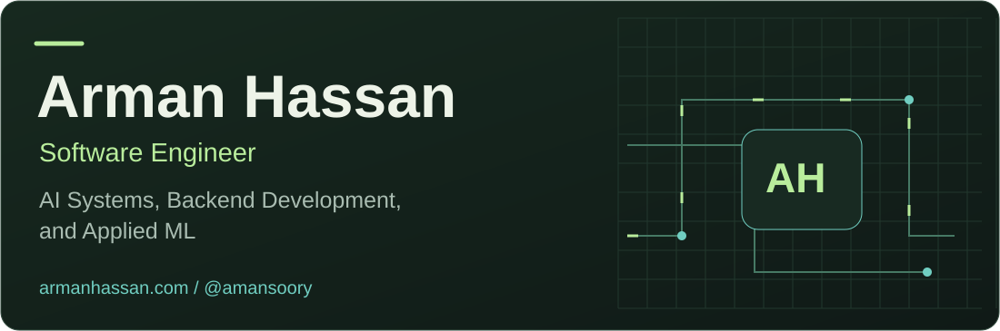
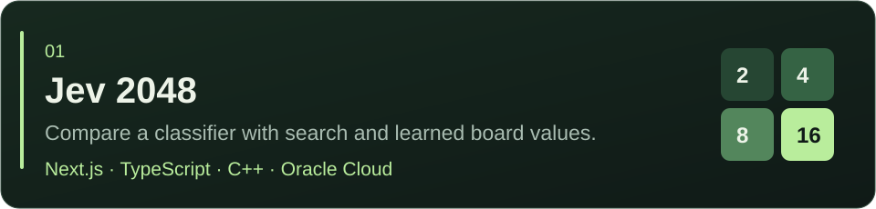
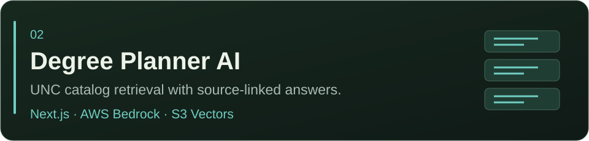
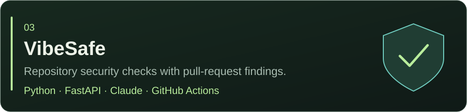
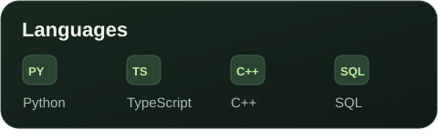
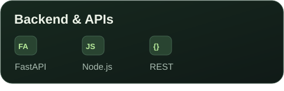
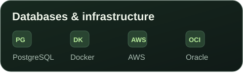
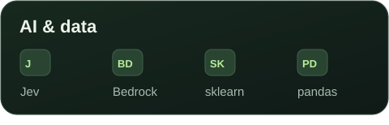
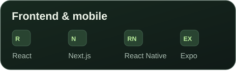

<a href="https://armanhassan.com"><picture><source media="(max-width: 600px)" srcset="assets/hero-mobile.svg" /></picture></a>

**Computer Science at UNC Chapel Hill · Data Science minor · Graduating May 2027**  
Software Engineering Intern · Chapel Hill, North Carolina

## About me

I build the parts around a model that make it useful: retrieval, APIs, data pipelines, and interfaces. Recently, that has meant serving a pretrained C++ model from an ARM server and building a degree planner that cites the UNC catalog. I like trying new tools, then measuring what they actually do.

## Featured work

<a href="https://jev-2048.vercel.app"><picture><source media="(max-width: 600px)" srcset="assets/project-jev-mobile.svg" /></picture></a>

I built the seeded game controller, anonymous move comparisons, and decision inspector. A persistent native worker serves the pretrained n-tuple model on Oracle Cloud; the Next.js frontend runs on Vercel. The project keeps timing, probabilities, and saved results open to inspection.

[**Play →**](https://jev-2048.vercel.app) · [Case study](https://armanhassan.com/projects/jev-2048) · [Source](https://github.com/amansoory/JEV2048)

<a href="https://unc-degree-rag.vercel.app/"><picture><source media="(max-width: 600px)" srcset="assets/project-degree-mobile.svg" /></picture></a>

I built the catalog-processing pipeline, retrieval, and program routing so answers can point back to their sources.

[**Try it →**](https://unc-degree-rag.vercel.app/) · [Case study](https://armanhassan.com/projects/degree-planner-ai)

<a href="https://vibe-safe-pt7v.vercel.app"><picture><source media="(max-width: 600px)" srcset="assets/project-vibesafe-mobile.svg" /></picture></a>

Combines rule-based checks, configuration analysis, and model review. Findings appear on pull requests, with critical issues failing CI.

[**Open project →**](https://vibe-safe-pt7v.vercel.app) · [Case study](https://armanhassan.com/projects/vibesafe) · [Source](https://github.com/amansoory/VibeSafe)

## Experience

- **Software Engineering Intern · Timing**  
  Worked on contact-prioritization agents, retrieval over interaction history, and backend performance.
- **Teaching Assistant · UNC Chapel Hill**  
  Led Python labs and helped students debug in office hours for a course with 200+ students.
- **XMAX Auto Parts**

[More about my work →](https://armanhassan.com/#experience)

## Tools I work with

## Currently building

I’m exploring fast classification and decision layers for larger AI systems: code produces valid options, a model judges them, and code checks the choice before acting. Jev 2048 is where I’m testing how much the information supplied changes those decisions.

## Get in touch

Want to talk about a project or an engineering role? [Email me](mailto:armanmansoorhassan@gmail.com) or [connect on LinkedIn](https://linkedin.com/in/arman-hassan1).
